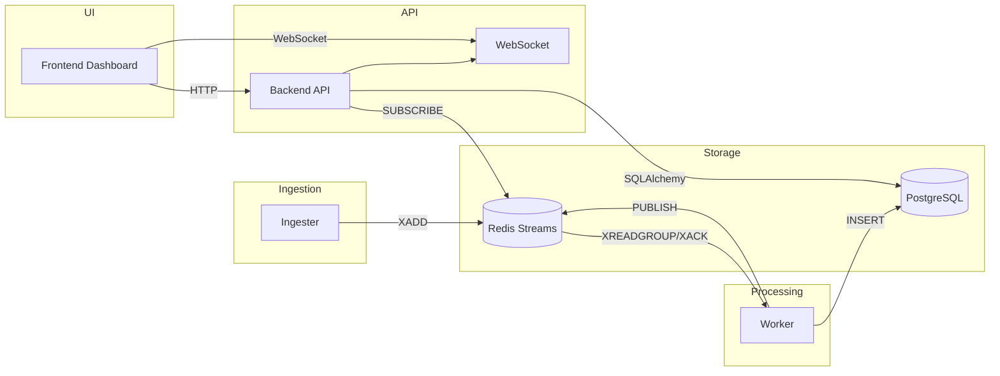

# Architecture

## System Diagram

## Component Descriptions

- Database (PostgreSQL): stores posts, analyses, and alerts with required indexes.
- Redis: streams for ingestion and pub/sub for real-time updates.
- Ingester: generates realistic posts and publishes to Redis Streams.
- Worker: consumes from streams, runs AI analysis, writes to Postgres, publishes updates.
- Backend API: REST endpoints, WebSocket broadcast, caching.
- Frontend: React dashboard with charts and live feed.

## Data Flow

1. Ingester generates a post and publishes via XADD to Redis Stream.
2. Worker consumes with XREADGROUP, analyzes sentiment/emotion, stores in Postgres.
3. Worker publishes new post updates to Redis pub/sub.
4. Backend subscribes and broadcasts to WebSocket clients.
5. Frontend fetches initial data via REST and updates via WebSocket.

## Technology Justification

- Redis Streams provides at-least-once delivery and consumer groups.
- PostgreSQL supports strong schema, indexes, and time-based aggregation.
- FastAPI enables async REST + WebSocket endpoints.
- Transformers library provides local, fast model inference.
- Groq LLM offers external fallback and higher-quality classification.
- React + Vite delivers a fast, responsive UI and modern developer workflow.

## Database Schema

- social_media_posts(id, post_id, source, content, author, created_at, ingested_at)
- sentiment_analysis(id, post_id, model_name, sentiment_label, confidence_score, emotion, analyzed_at)
- sentiment_alerts(id, alert_type, threshold_value, actual_value, window_start, window_end, post_count, triggered_at, details)

Indexes:
- social_media_posts.post_id, source, created_at
- sentiment_analysis.analyzed_at
- sentiment_alerts.triggered_at

## API Design

REST endpoints:
- GET /api/health
- GET /api/posts
- GET /api/sentiment/aggregate
- GET /api/sentiment/distribution

WebSocket:
- ws://localhost:8000/ws/sentiment

All responses use JSON with explicit metadata for filters, pagination, and caching.

## Scalability Considerations

- Multiple workers can share a consumer group for parallel processing.
- Redis Streams support backpressure and replay.
- Database indexing supports high-volume time-series queries.
- Frontend uses incremental updates to avoid heavy polling.

## Security Considerations

- No secrets stored in code; all credentials provided via environment variables.
- External LLM keys are injected at runtime.
- Internal services are not exposed to the host network.
- Future improvements: auth for APIs, rate limiting, and TLS for WebSocket.
